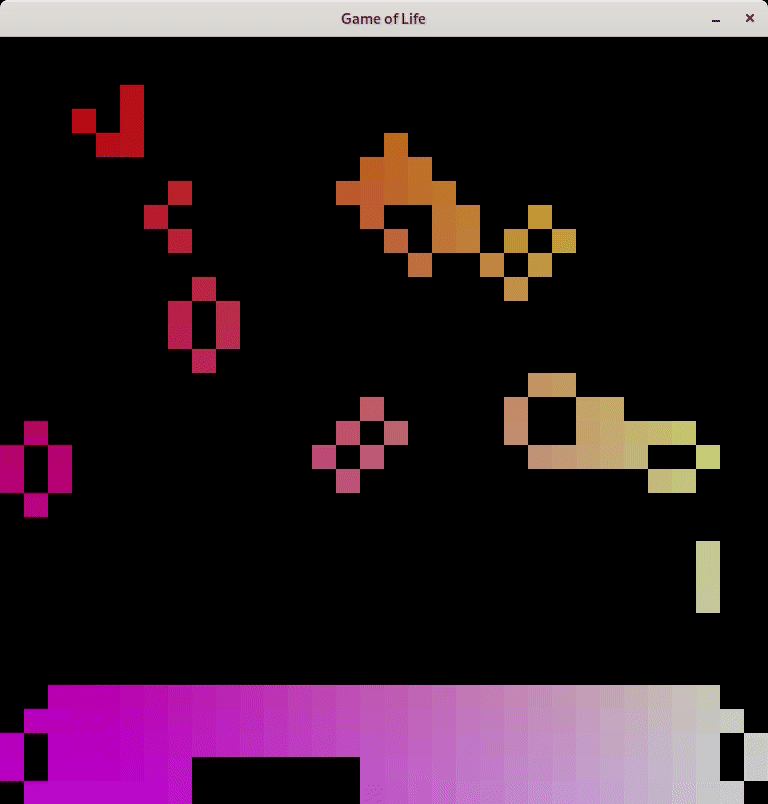

# Game of Life

Basic C implementation of the cellular automaton called Game of Life 
by John Conway supporting OpenGL and parallelization with OpenMP.



## Requirements:

Application has the following dependencies:

* C compiler  
  clang and gcc are tested
* SDL2
* SDL2-image
* mesa-libGLU  
  Only if compiling with OpenGL
* openmp  
  Only if compiling with OpenMP  
  May be included in your compiler

## Building

Build process respects the following environment variables:

* `GAMEOFLIFE_DEBUG`  
  For a build with debug symbols
* `GAMEOFLIFE_OPTIMIZED`  
  For an `-O3` optimized build
* `GAMEOFLIFE_PROFILING`  
  For including code for profiling
* `GAMEOFLIFE_OPENGL`  
  For using OpenGL for drawing (requires OpenGL - see above)
* `GAMEOFLIFE_OMP`  
  For using OpenMP (requires OpenMP - see above)

### Example

```
$ export GAMEOFLIFE_OPTIMIZED=1
$ export GAMEOFLIFE_OMP=1
$ export GAMEOFLIFE_OPENGL=
$ make
```
